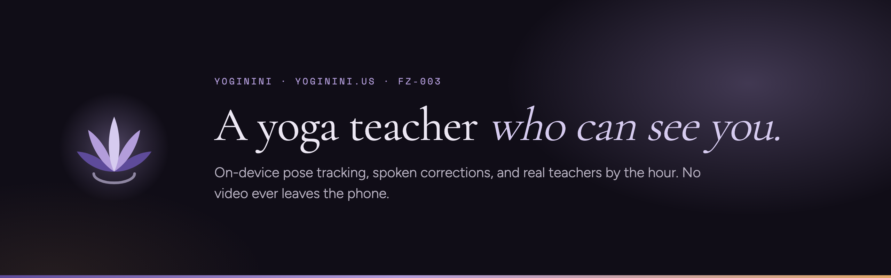

<p align="center">
  
</p>

<p align="center">
  
  
  
  
  
  
  
</p>

<p align="center">
  <b>yoginini.us</b> &middot; FZ-003
</p>

---

# The product

Yoginini is a yoga app that watches your form through your phone camera and
speaks corrections out loud, the way a teacher would across the room.

> **A yoga teacher who can see you.**
> Yoga has been taught one way for a few thousand years: a teacher watches, and
> says a little. We built a machine that can do the watching so more people can
> be taught, then set rules so it behaves like a good teacher would.

You prop your phone against a water bottle. A pose model running **on the
device** tracks 33 body landmarks, turns them into the angles between your
limbs, compares those to a reference a teacher recorded, and when something
drifts a calm voice says so. One cue at a time. Never twice in five seconds.

Between app sessions you can book a **real human teacher** by the hour. They set
their own rate, keep 80% of it, and arrive at the call already knowing where you
are stuck — because you chose to share your practice history with them.

### Privacy is the product, not a policy page

| | |
| :--- | :--- |
| Camera frames | Analysed on the phone, discarded frame by frame |
| Images uploaded | **Zero.** None are stored, so none can leak |
| What leaves the device | Joint angles, pose scores, session metadata |
| Why angles, not positions | An angle describes a shape. It cannot be turned back into a picture of a room |
| Sharing with a coach | Off by default, per scope, revocable |
| Leaderboards | None exist anywhere in the product |

### Pricing

| Plan | Price | Notes |
| :--- | :--- | :--- |
| Trial | **$3** / 14 days | Rolls into membership on day 14 unless cancelled; email on day 12 |
| Membership | **$15** / month | Same price on web and in-app |
| Coaching | **$50–85** / hr | Not included. Coach sets the rate and keeps **80%** |
| Repeat bookings | 10–12% | Platform share drops after a student's first session with the same coach |

---

# Status

**Nothing has shipped.** This repository is a pre-launch website, and the site
says so on every page it could possibly mislead someone on.

- No app exists. There is no App Store or Play Store listing, and no link
  pretending there is one.
- **No coaches are signed.** The Coaches page publishes zero profiles.
- No accounts, no checkout, no payment field anywhere on the site.
- No usage, member or activity figures appear anywhere. If you find one, it is
  a bug — open an issue.
- The waitlist form is the only real transaction, and it only delivers once a
  mail provider is connected (see [Secrets](#secrets-not-set-yet)).

`window.YOG.status` in [`assets/yog-data.js`](assets/yog-data.js) is the single
switch. Every claim on the site is gated on it, so flipping a flag there and
rebuilding is the only way a page starts saying "live".

---

# Honesty notes on the design source

The site was built from a Claude Design project. Four things in that prototype
would have been dishonest shipped as-is, and were deliberately not reproduced:

| Prototype | What shipped instead |
| :--- | :--- |
| **Six named coaches** with photos, rates, languages and bookable slots | Nobody has signed. The grid now shows the **seats** in the founding cohort — style, indicative rate band, what we are looking for — and says plainly that there is nobody to book |
| **"318 on the mat right now, in 41 cities"**, "2,140 waiting", a live-ticking counter | Removed. No invented metrics anywhere, and none will be added until something real counts them |
| **An activity feed** of named people earning badges and sharing streaks | Replaced with feature explanations. Every remaining screen that depicts the app carries a visible `Preview` marker |
| **"Continue with Apple / Google / Meta"** buttons that only set a flag | A real waitlist form that posts to a real endpoint, and reports failure honestly when it cannot deliver |

The design source also linked "Privacy" at the home page. Privacy is the central
claim of this product, so it now has [its own page](privacy/index.html).

---

# The site

| Page | What it carries |
| :--- | :--- |
| [`/`](index.html) | Hero, how it works, privacy, the voice, coaches, community, streaks, pricing, teaching, FAQ |
| [`/philosophy/`](philosophy/index.html) | Sahasrara and why everything is purple, the seven principles, the name |
| [`/community/`](community/index.html) | Together rooms, friends, shared progress, circles, the ground rules |
| [`/coaches/`](coaches/index.html) | The founding cohort seats, how booking works, the economics, the application |
| [`/pricing/`](pricing/index.html) | Trial and membership, coach economics, billing FAQ |
| [`/privacy/`](privacy/index.html) | Exactly what is stored and what is not |

Directory-style URLs, static HTML, no client-side routing. Every word on every
page is in the HTML, so a crawler with JavaScript disabled reads the same site
a person does.

---

# Agent-readable layer

Answer engines are a first-class audience here, not an afterthought.

| Surface | Purpose |
| :--- | :--- |
| [`llms.txt`](llms.txt) | Plain-text brief for language models. Leads with the pre-launch status so a model cannot summarise this as a shipped product |
| [`yoginini.json`](yoginini.json) | The same facts as JSON — status, pricing, the pose library, the open coach seats, every FAQ. Served `Access-Control-Allow-Origin: *` |
| JSON-LD | `Organization`, `WebSite`, `SoftwareApplication`, two `Offer`s, `FAQPage`, `BreadcrumbList`. **No `aggregateRating` and no reviews** — nothing has shipped, so there is nothing to rate |
| [`robots.txt`](robots.txt) | GPTBot, ClaudeBot, PerplexityBot, Applebot, Google-Extended and friends explicitly allowed |
| `<link rel="alternate">` | Both machine surfaces are announced in every page head |

Both are generated by `tools/pages.js` from the same data as the pages, so they
cannot drift from what a human reads.

---

# Repo layout

```
yoginini/
├── index.html              generated — do not hand-edit
├── philosophy/  community/  coaches/  pricing/  privacy/
├── 404.html    sitemap.xml  llms.txt  yoginini.json   generated
├── robots.txt  _headers     _redirects  site.webmanifest
├── assets/
│   ├── yog.css             one stylesheet, token-driven
│   ├── yog-data.js         ← the single source of truth
│   ├── yog-common.js       nav, reveal, sheet, forms, filters
│   ├── favicon.svg         the crown lotus
│   ├── lotus-animated.svg  the mark, breathing (used on factory0.ventures)
│   └── og*.png  icon-512.png  apple-touch-icon.png  readme-banner.png
├── functions/api/
│   ├── waitlist.js         POST, 503 not_configured until secrets are set
│   └── coach-apply.js      POST, same contract
└── tools/
    ├── pages.js            generates every page, sitemap, llms.txt, yoginini.json
    ├── build-dist.sh       allowlist + content-hash stamping
    ├── render-og.sh        headless Chrome → every raster asset
    ├── og-render.html      the OG card template
    └── banner-render.html  the README banner template
```

---

# Working on it

No package manager, no dependencies, no build step for development.

```bash
node tools/pages.js          # regenerate every page from assets/yog-data.js
python3 -m http.server 8791  # then open http://localhost:8791
```

**Edit [`assets/yog-data.js`](assets/yog-data.js), then run `node tools/pages.js`.**
The HTML files are generated output — editing them directly means your change is
gone on the next build.

```bash
./tools/render-og.sh         # regenerate OG cards, banner and icons (needs Chrome)
./tools/build-dist.sh        # assemble dist/ exactly as it should be served
```

`render-og.sh` uses headless Chrome because ImageMagick cannot rasterize these
correctly — CSS gradients, webfonts and SVG transforms all have to render.

---

# Design

The palette is the crown chakra. Sahasrara, the seventh and highest, is drawn as
a thousand-petalled lotus and coloured violet, which is why everything here is
purple and why the mark is a lotus that opens on the breath.

| Token | | Use |
| :--- | :--- | :--- |
| `--dark` | `#100D17` | Headers, footers, the app mockup |
| `--panel` | `#1E1730` | Raised panels on dark |
| `--bg` | `#F5F2F8` | The page |
| `--band` | `#EBE6F1` | Alternating sections |
| `--ink` | `#1A1620` | Body text |
| `--purple` | `#5E4B9A` | Accent on light |
| `--lav` | `#B39DDB` | Accent on dark, primary button |
| `--lav-lt` | `#D6CBEF` | Italic emphasis in headlines |
| `--amber` | `#E0A86B` | The one warning colour — a flagged joint, a status dot |

Cormorant Garamond for display, Figtree for text, Space Mono for labels.
Every animation is behind `prefers-reduced-motion`.

---

# Deploying

Cloudflare Pages, project `yoginini`, on the Kontinuum account. The zone
`yoginini.us` is already active there.

```bash
./tools/build-dist.sh
npx wrangler pages deploy dist --project-name yoginini
```

`_headers` caches `/assets/*.css` and `*.js` immutably, which is only safe
because `build-dist.sh` stamps every reference with a content hash.

### Secrets not set yet

Both forms answer `503 not_configured` until these are Pages secrets, and the
pages say so and show the direct address rather than pretending to have sent:

| Secret | For |
| :--- | :--- |
| `RESEND_API_KEY` | Sending at all |
| `WAITLIST_TO` | Inbox for waitlist signups |
| `COACH_TO` | Inbox for founding-coach applications |
| `WAITLIST_FROM` | Optional. Defaults to `onboarding@resend.dev` |
| `TURNSTILE_SECRET` | Optional. Verifies a Turnstile token if present |

---

<p align="center">
  <sub>
    <b>FZ-003</b> &middot; a <a href="https://factory0.ventures">Factory Zero</a> venture &middot;
    <a href="mailto:contact@yoginini.us">contact@yoginini.us</a>
  </sub>
</p>
